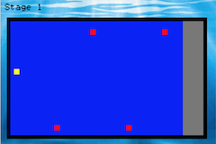
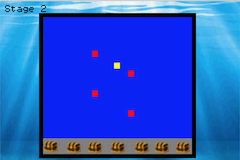

Finding Treasure
----------------

Introduction
------------
Finding Treasure is a GBA(GameBoyAdvance) game with the story that a diver finding treasure boxes under the sea by escaping sharks' attack.
There are two stages you have to clear.
If you clear those two stages, you can be a billionaire!
However, you could be eaten by a lot of sharks under the sea if you are not good at control.
Risk comes at a cost!

How to play
-----------
* Control your character (yellow square) with arrow keys ↑(UP), →(Right), ↓(Down), ←(Left)

* By not colliding with sharks(red squares), pass the goal!

Install
-------
Confirmed Running Environment: Linux

Type this commend below on your terminal:

```shell
$ sudo apt update
$ sudo apt upgrade
$ sudo apt install gcc-arm-none-eabi cs2110-vbam-sdl mednafen cs2110-gba-linker-script nin10kit
$ sudo add-apt-repository ppa:tricksterguy87/ppa-gt-cs2110
```
Run:
```shell
make emu
```
OR
```shell
make med
```

If the commends above are not working:
```shell
$ sudo add-apt-repository ppa:sergio-br2/vbam-trunk
$ sudo apt update
$ sudo apt install vbam-sdl vbam
```

Play Screen
-----------
##Start Screen:


##Intro Page:


##Play Screen:






##If you lost:


##If you won:


Author
------
Daewoong Ko(daewoong.ko@gatech.edu)
